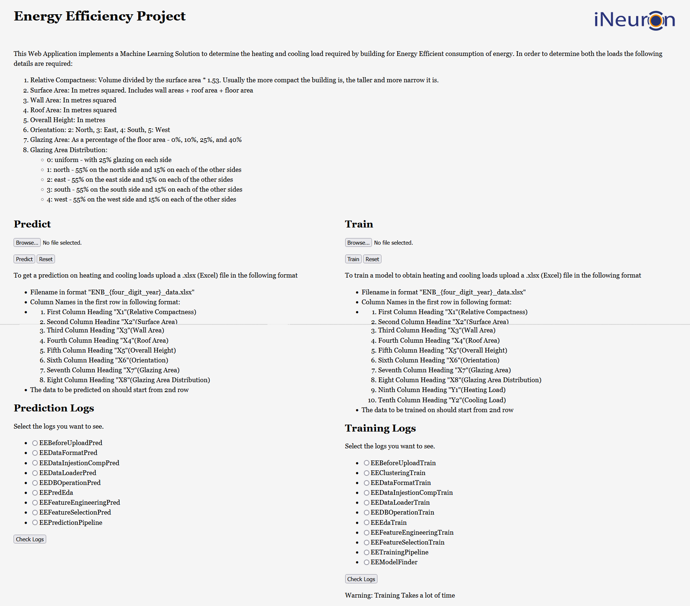
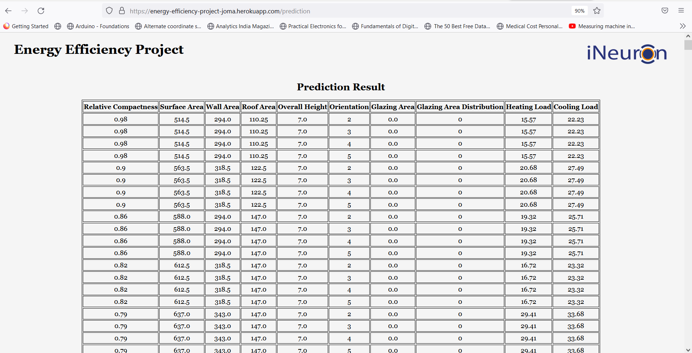

# **Energy Efficiency**



* This repository implements "Energy Efficiency" project work done through internship under ineuron.ai.
* With the help of this project we can estimate the heating and cooling loads required for a building for efficient energy consmption.

## **Description**
* This implementation requires eight inputs from a user in an Excel file which the user can upload through the web application. The inputs are described below:
    1. Relative Compactness: 
        Volume divided by the surface area * 1.53. Usually the more compact the building is, the taller and more narrow it is.
    2. Surface Area: 
        In metres squared. Includes wall areas + roof area + floor area.
    3. Wall Area: In metres squared
    4. Roof Area: In metres squared
    5. Overall Height: In metres
    6. Orientation: 
        2: North, 
        3: East, 
        4: South, 
        5: West
    7. Glazing Area: 
        As a percentage of the floor area - 0%, 10%, 25%, and 40%
    8. Glazing Area Distribution: 
        0: uniform - with 25% glazing on each side
        1: north - 55% on the north side and 15% on each of the other sides
        2: east - 55% on the east side and 15% on each of the other sides
        3: south - 55% on the south side and 15% on each of the other sides
        4: west - 55% on the west side and 15% on each of the other sides

* The output is represented in a tabular form along with the corresponding inputs.
* The Web Application which implements this repository also provides the facility to retrain the model used to predict the heating and cooling load. 
* We can also see the logs to understand whether the application is working properly.

## **Workflow**


## **Dataset**
* The dataset used for training the model is available [here](https://archive.ics.uci.edu/ml/datasets/energy+efficiency)

## **Installation**

### **Requirements**

* Python 3.5+
* scikit-learn 0.24.2
* xgboost 0.90
* pandas 1.0.0
* numpy 1.19.5
* Flask 1.1.1
* cassandra-driver 3.25.0

### **Setup**
1. Install Machine Learning Libraries
```
pip install scikit-learn==0.24.2 xgboost==0.90 pandas==1.0.0
```
2. Install Library for hosting Web Application on heroku
```
pip install Flask==1.1.1
```
3. Install Database interface libary
```
pip install cassandra-driver==3.25.0
```
4. Install supporting libraries
```
pip install pandas==1.0.0 numpy==1.19.5
```


## **Implementation**
* A working implementation of the project as a Web Application in this repository is available [here](https://energy-efficiency-project-joma.herokuapp.com/)

## **Contributors**
* [Jobin Mathew](https://www.linkedin.com/in/jobin-mathew-78b782149/)
* [Vineet Kumar]()


